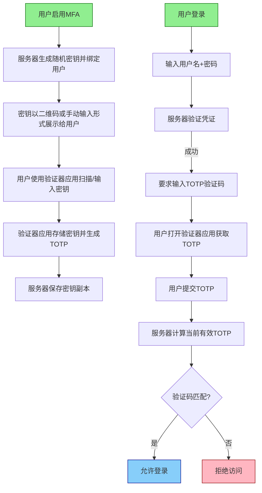

# 2FA 认证

```mermaid
flowchart TD
    A[用户启用MFA] --> B[服务器生成随机密钥并绑定用户]
    B --> C[密钥以二维码或手动输入形式展示给用户]
    C --> D[用户使用验证器应用扫描/输入密钥]
    D --> E[验证器应用存储密钥并生成TOTP]
    E --> F[服务器保存密钥副本]

    G[用户登录] --> H[输入用户名+密码]
    H --> I[服务器验证凭证]
    I --> |成功| J[要求输入TOTP验证码]
    J --> K[用户打开验证器应用获取TOTP]
    K --> L[用户提交TOTP]
    L --> M[服务器计算当前有效TOTP]
    M --> N{验证码匹配?}
    N --> |是| O[允许登录]
    N --> |否| P[拒绝访问]

    style A fill:#90EE90,stroke:#006400
    style G fill:#90EE90,stroke:#006400
    style O fill:#87CEFA,stroke:#00008B
    style P fill:#FFB6C1,stroke:#8B0000
```