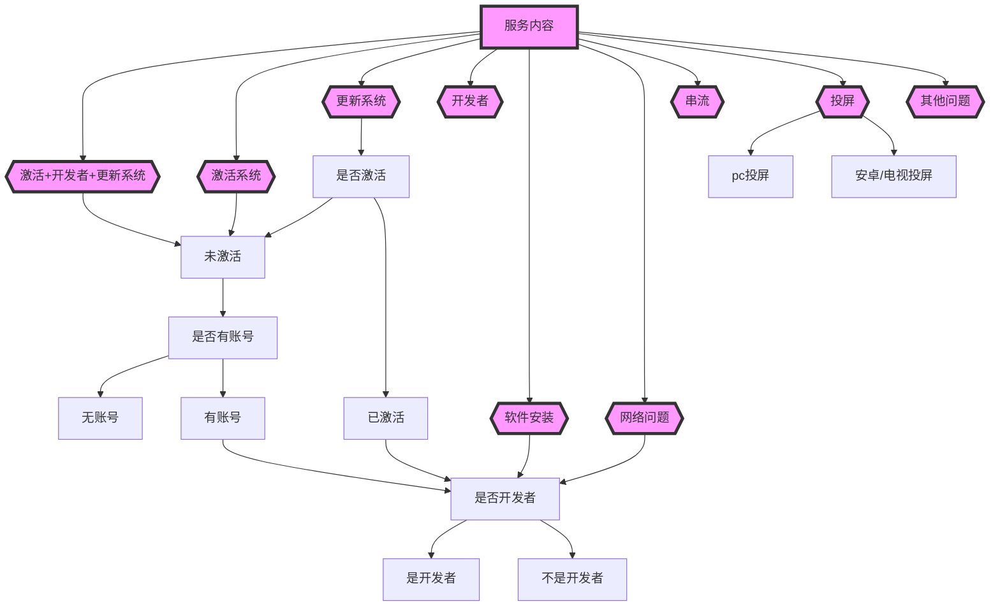

```mermaid
flowchart 
    服务内容:::main
    服务内容 --> A{{激活+开发者+更新系统}}:::main
    服务内容 --> B{{激活系统}}:::main
    服务内容 --> C{{更新系统}}:::main
    服务内容 --> D{{开发者}}:::main
    服务内容 --> G{{软件安装}}:::main
    服务内容 --> H{{网络问题}}:::main
    服务内容 --> E{{串流}}:::main
    服务内容 --> F{{投屏}}:::main
    服务内容 --> I{{其他问题}}:::main
    classDef main fill:#f9f,stroke:#333,stroke-width:4px
    
    C --> 是否激活

    是否激活 --> 未激活
    是否激活 --> 已激活
    未激活 --> 是否有账号
    是否有账号 --> 无账号
    是否有账号 --> 有账号
    有账号 --> 是否开发者
    是否开发者 --> 是开发者
    是否开发者 --> 不是开发者

    B --> 未激活
    A --> 未激活
    
    
    
    已激活 --> 是否开发者

    F --> pc投屏
    F --> 安卓/电视投屏
    
    G --> 是否开发者
    
    H --> 是否开发者
```