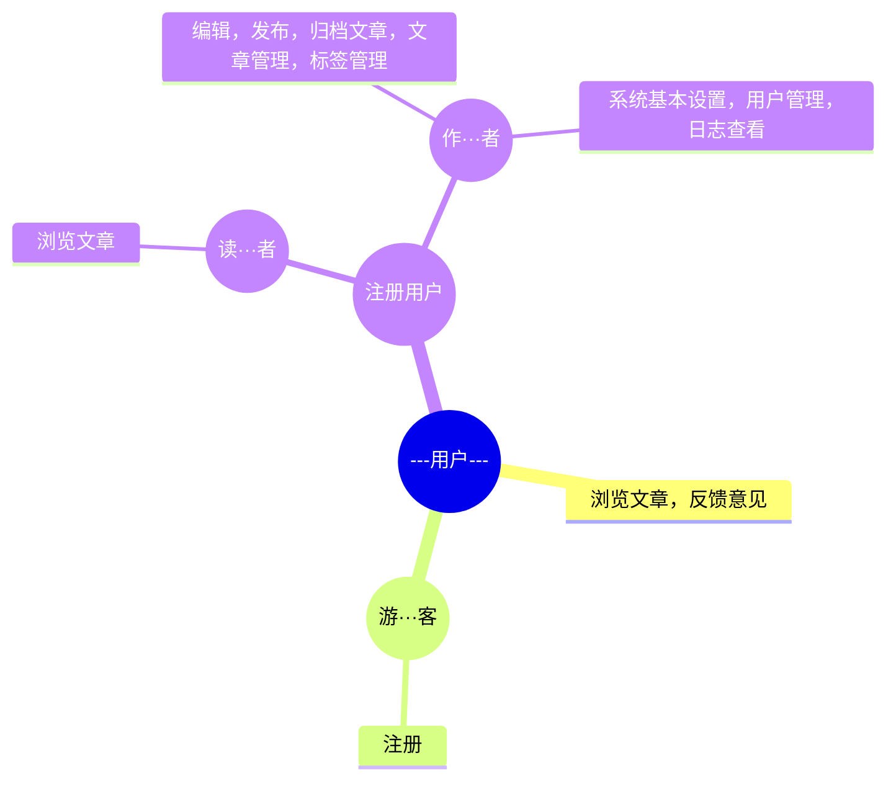
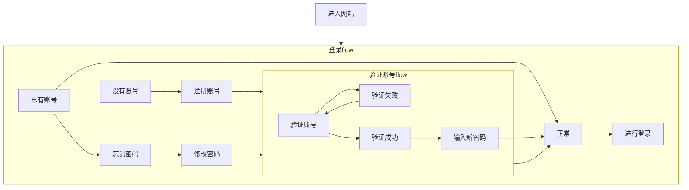
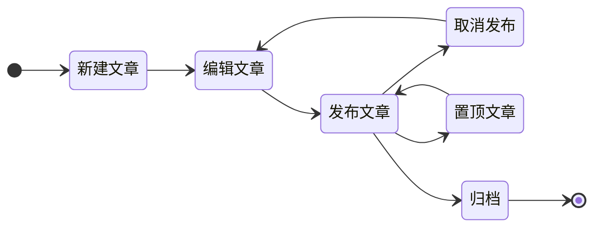
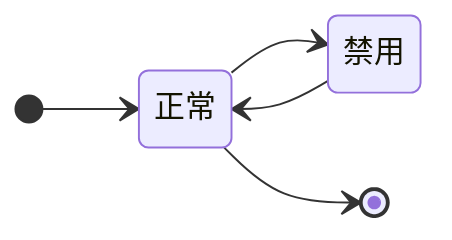

# thatisme产品需求文档

+ 产品负责人：ajiuaq
+ 文档审核人：ajiuaq
+ 开始时间：2021-06-28

[TOC]

## 文档历史记录

| 编号 | 日期 | 版本 | 描述 | 作者 | 审核 |
|:---|----|----|----|----|----|
|    |    |    |    |    |    |

## 产品概述

### 目标&意义

+ 项目目标
  一个拥有作者文章管理，读者文章浏览、评论的博客系统。

+ 项目意义
  对自己软件开发知识的整理提升。
  对技术、生活的分享。

+ 目标用户
  作者：我和别人
  读者：所有人

### 领域知识

+ 业务背景
  个人博客是用来进行知识、心情分享的平台。通过在博客上发表文章、图片等来表达自己的观点、看法等。通过评论功能促进作者和读者，读者和读者之间的交流，以达到共同成长、进步的目的。

+ 业务知识
  系统用户为作者和读者两端，其中：作者通过系统来进行文章的创作和编辑，并进行发表和管理；读者可阅读系统中已发布的文档，并通过评论功能和作者、其他读者进行交流。该系统包括作者管理、文章编辑、文章管理、文章阅读、文章评论等功能。

## 名词解释

+ 博客
  在本系统中，即为网站整体，包括系作者、读者的可交互网站。
+ 作者
  在系统中进行文章编辑、发表的角色。
+ 读者
  在系统中浏览、评论文章的角色。
+ 文章
  由作者编辑，具有一定的表达目的，由文字或图片组成的有条理性的阅读内容。
+ 评论
  读者或者作者对文章或其他评论发表自己的想法、看法、较短的可阅读内容。

+ 图集
  以图片为主，文字为辅，主要用以展示图片的阅读内容。

## 用户行为 这里可以使用用例图

+ 用户
    + 浏览文章，反馈意见
    + 游客
        + 注册
    + 注册用户
        + 登录，发表评论
        + 读者
        + 作者（管理员）
            + 编辑，发布，归档文章，文章管理，标签管理
            + 系统基本设置，用户管理，日志查看

### 总体流程图

#### 用户

+ 用户登录
  用户进入登录界面
  没有账号注册
  输入邮箱，获取验证码
  验证验证码
  验证成功，根据用户名、密码等注册账号
  用户输入账号密码，进行登录
+ 修改密码
  用户已登录
  验证邮箱
  输入新密码
  修改密码
  重新登陆
+ 忘记密码
  验证邮箱
  输入新密码
  进行登录
+ 用户管理
  加入黑名单

#### 文章状态

#### 用户状态

### 时序图

## 思维导图

+ 领域建模
  业务流程图

## 功能范围

+ 功能名称
    + 功能说明
    + 用例说明
    + 操作流程
    + 界面原型
    + 对应字段
    + 相关规则

## 非功能需求

+ 规则变更需求
+ 产品服务需求
+ 帮助需求
+ 安全性需求
+ 上线实现需求

## 上线时间安排表
