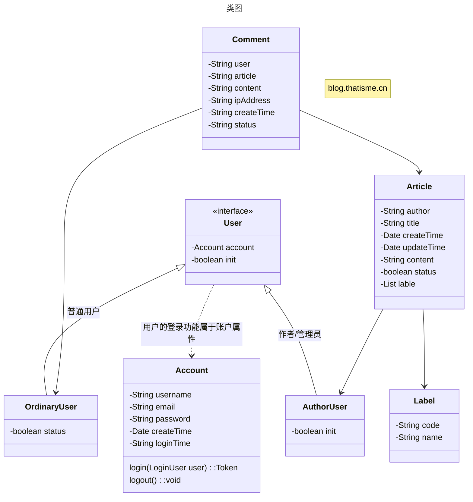
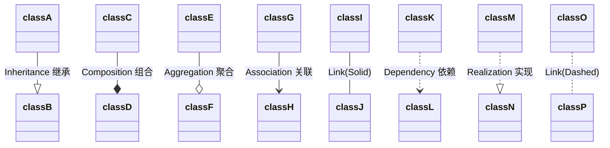

# 类图

## 用户行为
### 张三
+ 张三进入网站，看到一组文章，包含封面，标题，简介，发布时间，第一个是一个标有`置顶`的文章
+ 张三对该组文章不感兴趣，浏览下一组
+ 张三还是不感兴趣，看到有搜索框，准备搜索
+ 张三一时也不知道搜索关键词填什么，看到搜索框旁边可以选择标签
+ 张三选了`java`标签，点击搜索，开始浏览
+ 张三点击一篇文章，进入文章详情页
+ 详情页展示了文章标题、作者、目录、正文、发表时间
+ 下方有别人发表的评论，可以自己评论，也可以针对某个评论进行回复
+ 张三输入评论，点击发表评论，提示需要进行登录
+ 张三使用邮箱进行注册、登录，然后点击发表评论，需要输入验证码，输入验证码后发表评论
+ 发表后张三看到了自己的评论，有评论人，ip属地，内容，发表时间
### 李四，李四有读者功能
+ 李四是系统的管理员/文章作者
+ 李四进入系统，登录账号，右上角有进入管理端入口
+ 李四进入管理端，有统计信息、文章管理、用户管理等功能
+ 李四进入文章管理，新建了一个文章，编辑完后，预览查看，效果不错
+ 李四准备发表文章，需要手机验证码，输入手机验证码后，文章发表成功
+ 李四点击之前发布的一篇文章的评论管理功能，对一条不适评论进行了屏蔽处理
+ 李四进入用户管理功能，对之前那个发表不适评论的用户进行账号禁用

